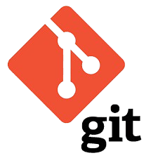
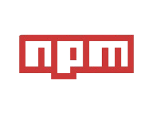

## Web Developer 👨‍💻

    Hello! I'm <b>Ammar</b>, a passionate web developer and undergraduate student pursuing my BSIT degree at the University of Agriculture, Faisalabad (UAF). With a keen interest in building innovative web solutions, I'm always looking to collaborate on exciting projects and learn from the open-source community. Feel free to explore my repositories, where you'll find a mix of personal projects, contributions, and experiments in web development. Let's connect and create something amazing together!

- Solved 150+ Data Structures & Algorithms problems on [Leetcode](https://leetcode.com/iammar911/).

- Completed 9/9 Questions in CS50x organized by [@Harvard University](https://www.harvard.edu/) and secured [1st Position](https://www.linkedin.com/posts/ch-ammar-a1115527b_cs50x-puzzleday-harvard-activity-7185500165296857088-B8RA?utm_source=share&utm_medium=member_desktop).

- Typing speed 45WPM+ [@Monkeytype](https://monkeytype.com/profile/iammar99/).

- [@Participated](https://lablab.ai/u/@iammar) in multiple AI International Hackathons of [lablab.ai](https://lablab.ai/) with a global team of six Hackathons.

- [Presented](https://www.linkedin.com/posts/ch-ammar-a1115527b_icodeguru-leetcode-validparenthesesstring-activity-7204806350973927424-VUPf?utm_source=share&utm_medium=member_desktop) in the [@icodeguru](https://icodeguru.weebly.com/) session.

## Technologies & Tools 💻

## Skills

<table style="width: 100%; border-collapse: collapse;" align="center">
  <tr>
    <td style="text-align: center; padding: 20px;">
      <h3>Frontend</h3>
      
      
      
      
      
      
      
    </td>
  </tr>
  <tr>
    <td style="text-align: center; padding: 20px;">
      <h3>Languages</h3>
      
      
      
      
    </td>
  </tr>
  <tr>
    <td style="text-align: center; padding: 20px;">
      <h3>Others</h3>
      
      
      
      
      
      
      
      
    </td>
  </tr>
</table>

## Connect With me

    
    
    
    
    

## Stats 📊

    

## Leetcode Stats 📊

 
  

